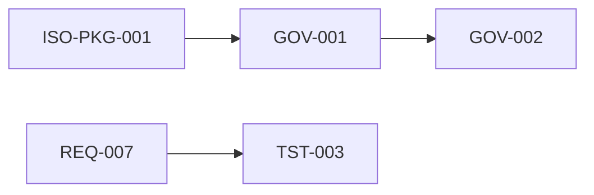

# Traceability between controlled documents

**Document:** QMS-D2D-001  
**Version:** 0.1  
**Date:** 2026-04-01  

Directed relationships between controlled codes (illustrative). Expand as the management system matures.

| Source | Target | Relationship |
|--------|--------|--------------|
| ISO-PKG-001 | GOV-* … AI-* | Master register → controlled stubs |
| GOV-001 | GOV-002 | Scope informs policy |
| GOV-007 | REC-TPL-001 | Document control → record templates |
| REQ-007 | REQ-002, REQ-003, REQ-004 | RTM → requirement specifications |
| TST-003 | REQ-007 | Test cases ↔ requirements traceability |
| PROC-MAN-004 | TST-001, QLT-001 | Process links to test and SDLC |
| ARC-004 | tests/api/contract.test.ts | API spec ↔ contract tests (evidence in repo) |

## Revision history

| Version | Date | Author | Summary of changes |
|---------|------|--------|-------------------|
| 0.1 | 2026-04-01 | BizCode | Initial graph |

**Other languages:** [Español](../../es/certificacion-iso/trazabilidad-entre-documentos.md) · [Português](../../pt-br/certificacion-iso/rastreabilidade-entre-documentos.md)
