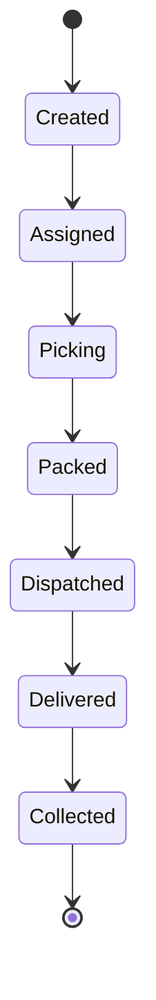

# Operational flow — order → delivery → collection (design)

**Design-only document.** It does not assert that UI or REST resources for “orders” exist; the current MVP centers on customers, products, and invoices ([`docs/api/openapi.yaml`](../../api/openapi.yaml)). Align conceptual states with the master plan; map responsibilities to roles that **already exist** in [`src/lib/rbac.ts`](../../../src/lib/rbac.ts).

## Proposed lifecycle (target)

## Canonical implementation states (BP1-1 / GitHub #65)

The diagram above uses **user-facing lifecycle names**. When persisting a `Pedido` entity (future BP1-1), OpenAPI and Prisma should use the **stable English keys** below so issues, ADRs, and code stay aligned.

| Implementation key | Maps from diagram | Meaning |
|--------------------|--------------------|---------|
| `draft` | Created | Order captured; editable; not yet committed to fulfillment. |
| `confirmed` | Assigned | Committed for planning; warehouse/route assignment may proceed. |
| `packed` | Picking / Packed | Stock prepared / ready for dispatch (may stay a single state in MVP). |
| `shipped` | Dispatched | Handed to carrier or driver leg. |
| `delivered` | Delivered | Receipt confirmed. |
| `invoiced` | (implicit before collection) | Linked invoice issued (`Factura`); financial record exists. |
| `collected` | Collected | Payment / settlement closed for the order line. |

**Transitions (normative):** invalid jumps (e.g. `draft` → `collected` without intermediate states) must be rejected by the future API. Cancellations: only from `draft` or `confirmed` unless a separate `cancelled` terminal state is added in the implementation ADR.

**Integrations (unchanged intent):** `Cliente.creditLimit`, `Articulo.stock`, `DeliveryZone`, and channel scope (`x-bizcode-channel` / `AuthScope.channels`) apply at the same gates described in the RACI table.

**Sketches (no migrations):** Prisma/OpenAPI **draft** artifacts for BP1-1 live in [order-domain-implementation-sketch.md](order-domain-implementation-sketch.md) (EN; ES/PT-BR in locale map).

| State (concept) | Meaning |
|-----------------|--------|
| Created | Order captured (sales / backoffice). |
| Assigned | Routed to warehouse or route (planner / lead). |
| Picking | Stock preparation (`orders.pick`). |
| Packed | Ready for dispatch (operational detail; may merge with Picking in MVP). |
| Dispatched | Handed to carrier or driver (`orders.dispatch`). |
| Delivered | Confirmed receipt (`orders.deliver.confirm`). |
| Collected | Payment / settlement aligned with finance or cashier (business close-out). |

## RACI-style mapping (roles vs steps)

“R” = primary executor, “A” = accountable, “C” = consulted, “I” = informed. Permissions in parentheses are from the RBAC matrix.

| Step | seller | manager | backoffice | warehouse_op | warehouse_lead | logistics_planner | driver | billing / cashier | collections / finance | auditor |
|------|--------|---------|------------|--------------|----------------|-------------------|--------|---------------------|----------------------|---------|
| Create / register order | R (`orders.create`, `sales.create`) | R | C | I | I | I | I | C | I | I |
| Assign / prioritize | C | R | C | I | R | R | I | I | I | I |
| Picking | I | C | I | R (`orders.pick`) | R | I | I | I | I | I |
| Dispatch | I | C | I | I | R (`orders.dispatch`) | R (`orders.dispatch`) | I | I | I | I |
| Delivery confirm | I | I | I | I | I | I | R (`orders.deliver.confirm`) | I | I | I |
| Invoicing / payment link | C | C | C | I | I | I | I | R (`sales.create`) | C (`reports.financial.read`) | I |
| Collection / reconciliation | I | I | I | I | I | I | I | C | R | C (`audit.read` where applicable) |
| Audit review | I | I | I | I | I | I | I | I | I | R (`audit.read`) |

Empty cells mean no direct RBAC permission names the step; the role may still participate by process design.

## Current MVP vs future “order” phase

| Area | In repository today | Future (per backlog) |
|------|---------------------|----------------------|
| Customers / products / categories | REST under `/api/clientes`, `/api/articulos`, `/api/rubros` with auth | Extend as needed |
| Invoicing | `/api/facturas`, `/api/formas-pago` | Same stack |
| Order entity `pedido` | **Not evidenced** in Prisma or OpenAPI | Model, states, and APIs when backlog BP1-1 is executed |
| Permissions `orders.*` | Defined in RBAC; not wired to a domain entity yet | Enforce on new routes when implemented |

## Related documents

- RBAC matrix: [rbac-matrix-roles-permissions-scopes.md](rbac-matrix-roles-permissions-scopes.md)
- Master plan + P0/P1 backlog: [master-plan-bizcode-execution.md](master-plan-bizcode-execution.md)
- IAM: [iam-model-sessions-audit.md](iam-model-sessions-audit.md)
