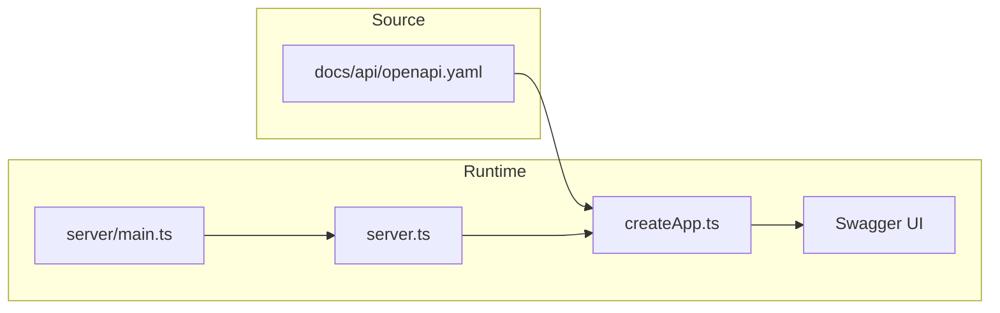

# Swagger / OpenAPI UI — implementation and reference plan

| | |
|---|---|
| **Document version** | 1.2.0 |
| **Last updated** | 2026-04-06 |
| **Semantic versioning** | This document follows the product [SemVer / changelog](../certificacion-iso/document-lifecycle-and-validation.md) policy; bump **minor** for added sections, **patch** for clarifications. |
| **Status** | **Implemented** — Swagger UI is served at `/api-docs` from [`server/createApp.ts`](../../../server/createApp.ts) (`swagger-ui-express` + [`docs/api/openapi.yaml`](../../api/openapi.yaml)); tests in [`tests/api/swagger-ui.test.ts`](../../../tests/api/swagger-ui.test.ts). |

## Purpose

- Provide a **single, trilingual** (logical document in three locale paths) reference for **Swagger UI** integration and **OpenAPI** obligations for agents and contributors.
- Align with [document-lifecycle-and-validation.md](../certificacion-iso/document-lifecycle-and-validation.md) and [ADR-0003](../adr/ADR-0003-api-contract-testing.md).

## Terminology

- **OpenAPI** — the contract format; canonical file: [`docs/api/openapi.yaml`](../../api/openapi.yaml) (single file, not translated).
- **Swagger UI** — interactive explorer at **`/api-docs`** (e.g. `http://localhost:3001/api-docs/` with `npm run server`). It **does not** replace the YAML file or [contract tests](../../../tests/api/contract.test.ts).

## Current repository state (as of last review)

- **Swagger UI / `swagger-ui-express`:** dependency in [`package.json`](../../../package.json); mounted in [`server/createApp.ts`](../../../server/createApp.ts); OpenAPI loaded with [`yaml`](../../../package.json) (runtime dependency).
- **Contract:** [`docs/api/openapi.yaml`](../../api/openapi.yaml) + [`tests/api/contract.test.ts`](../../../tests/api/contract.test.ts) + [`tests/api/swagger-ui.test.ts`](../../../tests/api/swagger-ui.test.ts).
- **Server bootstrap:** `npm run server` → [`server/main.ts`](../../../server/main.ts) → [`server.ts`](../../../server.ts) (`startServer` → `createServerInstance` → `createApp`). Mount Swagger UI in **`createApp`** only (same app as supertest).
- **Coverage ([`vitest.config.ts`](../../../vitest.config.ts)):** `coverage.include` lists `server/createApp.ts` and `server.ts`; `server/main.ts` is excluded. New helpers (e.g. `server/openapiUi.ts`) must be added to `include` and fully covered, **or** keep setup inside `createApp.ts`.
- **Comments:** follow trilingual JSDoc (`@en` / `@es` / `@pt-BR`) for non-obvious blocks per [coding-standards.md](../coding-standards.md).

## Product decisions

- **UI stack:** **Swagger UI** via `swagger-ui-express` (ESM + Express 5 compatibility must be verified). **Fallback:** static HTML + Swagger UI CDN + HTTP route serving the YAML.
- **Source of truth:** always [`docs/api/openapi.yaml`](../../api/openapi.yaml).

## Implementation checklist

1. ~~Add dependency: `swagger-ui-express` (+ `@types/swagger-ui-express` if required).~~ **Done**
2. ~~In [`server/createApp.ts`](../../../server/createApp.ts), register **`/api-docs`** (`swaggerUi.serve` + `swaggerUi.setup`) loading the YAML via `yaml` and path from `import.meta.url` / `fileURLToPath`.~~ **Done**
3. ~~**Tests:** `supertest` — **200** and HTML indicating Swagger UI; **100%** coverage on included files.~~ **Done** ([`tests/api/swagger-ui.test.ts`](../../../tests/api/swagger-ui.test.ts))
4. ~~**Optional:** sentence under `info.description` in `openapi.yaml` pointing to `/api-docs`.~~ **Done**
5. **Docs:** README / changelogs — keep in sync when URLs or behaviour change.
6. **Agent rules:** [`.cursor/rules/bizcode.mdc`](../../../.cursor/rules/bizcode.mdc) and [`AGENTS.md`](../../../AGENTS.md) — updated for live `/api-docs`.

## Security note

Since IAM/RBAC Phase 1, operational endpoints (`clientes`, `articulos`, `rubros`, `formas-pago`, `facturas`) require an `HttpOnly` cookie session and role-based permissions. Only `/api/health` and bootstrap/authentication endpoints (`/api/auth/setup-owner`, `/api/auth/login`, `/api/auth/logout`, `/api/auth/me`) remain outside that protection level to allow initial access.

## Verification

- `npm run lint` · `npm run test` · `npm run type-check`
- `npm run check:docs-map` if [`DOCUMENT_LOCALE_MAP.md`](../../DOCUMENT_LOCALE_MAP.md) changes

## Architecture (runtime)

## Related documents

- [testing-strategy.md](testing-strategy.md) — contract tests vs OpenAPI
- [document-lifecycle-and-validation.md](../certificacion-iso/document-lifecycle-and-validation.md) — checklist when HTTP API behaviour changes
- [ADR-0003](../adr/ADR-0003-api-contract-testing.md) — contract testing decision
