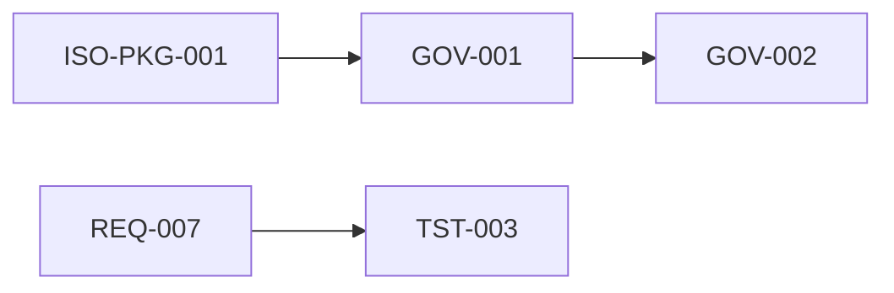

# Trazabilidad entre documentos controlados

**Documento:** QMS-D2D-001  
**Versión:** 0.1  
**Fecha:** 2026-04-01  

Relaciones dirigidas entre códigos controlados (ilustrativas). Ampliar según madurez del sistema de gestión.

| Origen | Destino | Relación |
|--------|---------|----------|
| ISO-PKG-001 | GOV-* … AI-* | Registro maestro → stubs controlados |
| GOV-001 | GOV-002 | Alcance informa la política |
| GOV-007 | REC-TPL-001 | Control documental → plantillas de registro |
| REQ-007 | REQ-002, REQ-003, REQ-004 | RTM → especificaciones |
| TST-003 | REQ-007 | Casos de prueba ↔ trazabilidad |
| PROC-MAN-004 | TST-001, QLT-001 | Proceso enlaza pruebas y SDLC |
| ARC-004 | tests/api/contract.test.ts | Especificación API ↔ pruebas de contrato |

## Historial de revisiones

| Versión | Fecha | Autor | Resumen de cambios |
|---------|-------|-------|-------------------|
| 0.1 | 2026-04-01 | BizCode | Grafo inicial |

**Otros idiomas:** [English](../../en/certificacion-iso/traceability-between-documents.md) · [Português](../../pt-br/certificacion-iso/rastreabilidade-entre-documentos.md)
