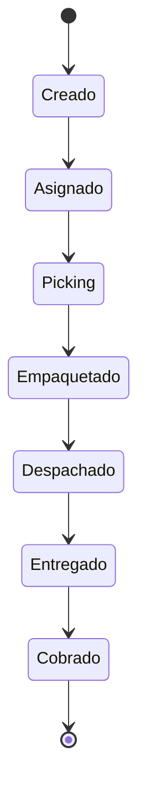

# Flujo operativo — pedido → entrega → cobranza (diseño)

**Documento solo de diseño.** No afirma que existan UI o recursos REST de “pedidos”; el MVP actual gira en clientes, productos y facturas ([`docs/api/openapi.yaml`](../../api/openapi.yaml)). Los estados conceptuales se alinean al plan maestro; las responsabilidades se mapean a roles **ya definidos** en [`src/lib/rbac.ts`](../../../src/lib/rbac.ts).

## Ciclo de vida propuesto (objetivo)

| Estado (concepto) | Significado |
|-------------------|-------------|
| Creado | Pedido capturado (ventas / backoffice). |
| Asignado | Enrutado a depósito o ruta (planificador / líder). |
| Picking | Preparación de stock (`orders.pick`). |
| Empaquetado | Listo para despacho (detalle operativo; puede fusionarse con Picking en MVP). |
| Despachado | Entregado a transportista o reparto (`orders.dispatch`). |
| Entregado | Confirmación de recepción (`orders.deliver.confirm`). |
| Cobrado | Pago / liquidación alineada con caja o finanzas (cierre comercial). |

## Mapa tipo RACI (roles vs pasos)

“R” = ejecutor principal, “A” = responsable final, “C” = consultado, “I” = informado. Los permisos entre paréntesis provienen de la matriz RBAC.

| Paso | seller | manager | backoffice | warehouse_op | warehouse_lead | logistics_planner | driver | billing / cashier | collections / finance | auditor |
|------|--------|---------|------------|--------------|----------------|-------------------|--------|---------------------|----------------------|---------|
| Crear / registrar pedido | R (`orders.create`, `sales.create`) | R | C | I | I | I | I | C | I | I |
| Asignar / priorizar | C | R | C | I | R | R | I | I | I | I |
| Picking | I | C | I | R (`orders.pick`) | R | I | I | I | I | I |
| Despacho | I | C | I | I | R (`orders.dispatch`) | R (`orders.dispatch`) | I | I | I | I |
| Confirmar entrega | I | I | I | I | I | I | R (`orders.deliver.confirm`) | I | I | I |
| Facturación / vínculo de pago | C | C | C | I | I | I | I | R (`sales.create`) | C (`reports.financial.read`) | I |
| Cobranza / conciliación | I | I | I | I | I | I | I | C | R | C (`audit.read` si aplica) |
| Revisión de auditoría | I | I | I | I | I | I | I | I | I | R (`audit.read`) |

Las celdas vacías indican que el paso no tiene un permiso RBAC dedicado; el rol puede participar por diseño de proceso.

## MVP actual vs fase “pedido” futura

| Área | En el repositorio hoy | Futuro (según backlog) |
|------|------------------------|-------------------------|
| Clientes / productos / rubros | REST bajo `/api/clientes`, `/api/articulos`, `/api/rubros` con auth | Ampliar según necesidad |
| Facturación | `/api/facturas`, `/api/formas-pago` | Misma base |
| Entidad pedido (`pedido`) | **No evidenciada** en Prisma ni OpenAPI | Modelo, estados y APIs al ejecutar BP1-1 del plan de ejecución |
| Permisos `orders.*` | Definidos en RBAC; sin entidad de dominio aún | Aplicar en nuevas rutas cuando existan |

## Documentos relacionados

- Matriz RBAC: [matriz-rbac-roles-permisos-scopes.md](matriz-rbac-roles-permisos-scopes.md)
- Plan maestro + backlog P0/P1: [ejecucion-plan-maestro-bizcode.md](ejecucion-plan-maestro-bizcode.md)
- IAM: [modelo-iam-sesiones-auditoria.md](modelo-iam-sesiones-auditoria.md)
