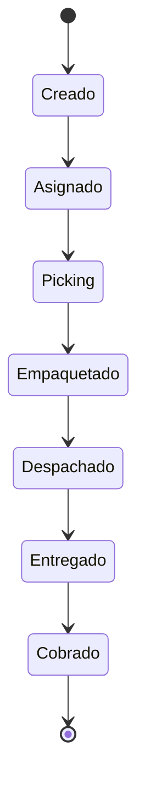

# Flujo operativo — pedido → entrega → cobranza (diseño)

**Documento solo de diseño.** No afirma que existan UI o recursos REST de “pedidos”; el MVP actual gira en clientes, productos y facturas ([`docs/api/openapi.yaml`](../../api/openapi.yaml)). Los estados conceptuales se alinean al plan maestro; las responsabilidades se mapean a roles **ya definidos** en [`src/lib/rbac.ts`](../../../src/lib/rbac.ts).

## Ciclo de vida propuesto (objetivo)

```mermaid
stateDiagram-v2
  [*] --> Creado
  Creado --> Asignado
  Asignado --> Picking
  Picking --> Empaquetado
  Empaquetado --> Despachado
  Despachado --> Entregado
  Entregado --> Cobrado
  Cobrado --> [*]
```

## Estados canónicos de implementación (BP1-1 / GitHub #65)

El diagrama usa **nombres de ciclo de vida orientados al usuario**. Cuando exista entidad persistida `Pedido`, OpenAPI y Prisma deben usar las **claves en inglés** siguientes para alinear issues, ADR y código.

| Clave de implementación | Equivale en el diagrama | Significado |
|--------------------------|-------------------------|-------------|
| `draft` | Creado | Pedido capturado; editable; aún no comprometido con cumplimiento. |
| `confirmed` | Asignado | Comprometido para planificación; puede asignarse depósito/ruta. |
| `packed` | Picking / Empaquetado | Stock preparado / listo para despacho (en MVP puede ser un solo estado). |
| `shipped` | Despachado | Entregado a transportista o tramo de reparto. |
| `delivered` | Entregado | Recepción confirmada. |
| `invoiced` | (antes de cobranza) | Factura vinculada (`Factura`) existente. |
| `collected` | Cobrado | Pago / liquidación cerrada para la línea del pedido. |

**Transiciones:** saltos inválidos (p. ej. `draft` → `collected`) deben rechazarse en la API futura. Cancelaciones: solo desde `draft` o `confirmed`, salvo que un ADR de implementación defina un terminal `cancelled`.

**Integraciones:** `Cliente.creditLimit`, `Articulo.stock`, `DeliveryZone` y ámbito de canal (`x-bizcode-channel` / `AuthScope.channels`) en los mismos hitos que la tabla RACI.

**Bocetos (sin migraciones):** artefactos Prisma/OpenAPI de trabajo en [boceto-implementacion-dominio-pedido.md](boceto-implementacion-dominio-pedido.md).

| Estado (concepto) | Significado |
|-------------------|-------------|
| Creado | Pedido capturado (ventas / backoffice). |
| Asignado | Enrutado a depósito o ruta (planificador / líder). |
| Picking | Preparación de stock (`orders.pick`). |
| Empaquetado | Listo para despacho (detalle operativo; puede fusionarse con Picking en MVP). |
| Despachado | Entregado a transportista o reparto (`orders.dispatch`). |
| Entregado | Confirmación de recepción (`orders.deliver.confirm`). |
| Cobrado | Pago / liquidación alineada con caja o finanzas (cierre comercial). |

## Mapa tipo RACI (roles vs pasos)

“R” = ejecutor principal, “A” = responsable final, “C” = consultado, “I” = informado. Los permisos entre paréntesis provienen de la matriz RBAC.

| Paso | seller | manager | backoffice | warehouse_op | warehouse_lead | logistics_planner | driver | billing / cashier | collections / finance | auditor |
|------|--------|---------|------------|--------------|----------------|-------------------|--------|---------------------|----------------------|---------|
| Crear / registrar pedido | R (`orders.create`, `sales.create`) | R | C | I | I | I | I | C | I | I |
| Asignar / priorizar | C | R | C | I | R | R | I | I | I | I |
| Picking | I | C | I | R (`orders.pick`) | R | I | I | I | I | I |
| Despacho | I | C | I | I | R (`orders.dispatch`) | R (`orders.dispatch`) | I | I | I | I |
| Confirmar entrega | I | I | I | I | I | I | R (`orders.deliver.confirm`) | I | I | I |
| Facturación / vínculo de pago | C | C | C | I | I | I | I | R (`sales.create`) | C (`reports.financial.read`) | I |
| Cobranza / conciliación | I | I | I | I | I | I | I | C | R | C (`audit.read` si aplica) |
| Revisión de auditoría | I | I | I | I | I | I | I | I | I | R (`audit.read`) |

Las celdas vacías indican que el paso no tiene un permiso RBAC dedicado; el rol puede participar por diseño de proceso.

## MVP actual vs fase “pedido” futura

| Área | En el repositorio hoy | Futuro (según backlog) |
|------|------------------------|-------------------------|
| Clientes / productos / rubros | REST bajo `/api/clientes`, `/api/articulos`, `/api/rubros` con auth | Ampliar según necesidad |
| Facturación | `/api/facturas`, `/api/formas-pago` | Misma base |
| Cobranzas / pagos | Modelo `Cobro`; `POST/GET /api/cobros`; UI `/cobros`; dashboard `cobrosHoy`; cobros recientes en formulario de cliente | Vincular a entidad pedido cuando exista BP1-1 |
| UI / finanzas CxC | `/finanzas`; `GET /api/reportes/aging`, `GET /api/reportes/cuenta-corriente/:clienteId` | Flujos de gestión de mora según backlog |
| Reportes | `/reportes`; `GET /api/reportes/ventas`, `stock-critico`, `cobranzas` (JSON o CSV) | Tipos de reporte adicionales |
| Logística | `/logistica`, `/logistica/picking` (#143); `OrdenEntrega`; `GET/POST/PUT /api/ordenes-entrega`, `POST .../iniciar-picking`, `POST .../lista` | OE: `pending` → `picking` → `ready` → `assigned` (reparto) → `in_transit` → `delivered` \| `failed` \| `cancelled` |
| Seguimiento GPS | `/logistica/seguimiento` (#144); `RepartoUbicacion`; `GET /api/repartos/activos`, `POST /api/repartos/{id}/ubicacion` | Chofer en reparto `on_route`; planificador ve última posición; retención 7 días |
| KPIs logística | `/logistica` pestaña Reportes (#145); `dispatchedAt`; `GET /api/logistica/kpis`, `reporte-choferes`, `reporte-zonas` | Planificador/manager; agregados en DB; export CSV |
| Entidad pedido (`pedido`) | BP1-1 completo (#391): `draft`…`collected` + sync remito/OE/cobro; MVP #132 + gating #223 | Facturación temprana; ver ADR-0009 |
| Permisos `orders.*` | Definidos en RBAC; aplicados en `/api/ordenes-entrega` | Extender cuando exista la entidad `pedido` |

El estado **Cobrado** del diagrama queda cubierto hoy en parte por el **registro de cobros** (`Cobro`), no por un registro `pedido`.

## Documentos relacionados

- Matriz RBAC: [matriz-rbac-roles-permisos-scopes.md](matriz-rbac-roles-permisos-scopes.md)
- Plan maestro + backlog P0/P1: [ejecucion-plan-maestro-bizcode.md](ejecucion-plan-maestro-bizcode.md)
- IAM: [modelo-iam-sesiones-auditoria.md](modelo-iam-sesiones-auditoria.md)
