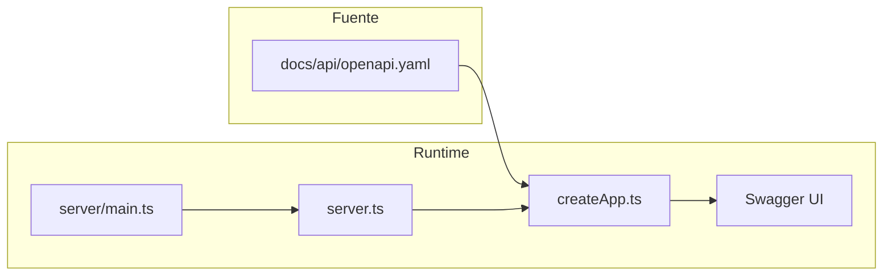

# Swagger / OpenAPI UI — plan de implementación y referencia

| | |
|---|---|
| **Versión del documento** | 1.2.0 |
| **Última actualización** | 2026-04-06 |
| **Versionado semántico** | Este documento sigue la política de producto [SemVer / changelog](../certificacion-iso/ciclo-vida-y-validacion-documental.md); incrementar **minor** si se añaden secciones, **patch** si solo hay aclaraciones. |
| **Estado** | **Implementado** — Swagger UI en `/api-docs` desde [`server/createApp.ts`](../../../server/createApp.ts) (`swagger-ui-express` + [`docs/api/openapi.yaml`](../../api/openapi.yaml)); pruebas en [`tests/api/swagger-ui.test.ts`](../../../tests/api/swagger-ui.test.ts). |

## Propósito

- Ofrecer una referencia **única y trilingüe** (mismo documento lógico en tres rutas localizadas) para la integración de **Swagger UI** y las obligaciones **OpenAPI** de agentes y colaboradores.
- Alinear con [ciclo-vida-y-validacion-documental.md](../certificacion-iso/ciclo-vida-y-validacion-documental.md) y [ADR-0003](../adr/ADR-0003-api-contract-testing.md).

## Terminología

- **OpenAPI** — formato del contrato; archivo canónico: [`docs/api/openapi.yaml`](../../api/openapi.yaml) (archivo único, no traducido).
- **Swagger UI** — explorador interactivo en **`/api-docs`** (p. ej. `http://localhost:3001/api-docs/` con `npm run server`). **No** sustituye el YAML ni las [pruebas de contrato](../../../tests/api/contract.test.ts).

## Estado actual del repositorio (última revisión)

- **Swagger UI / `swagger-ui-express`:** dependencia en [`package.json`](../../../package.json); montaje en [`server/createApp.ts`](../../../server/createApp.ts); OpenAPI con [`yaml`](../../../package.json) (dependencia de ejecución).
- **Contrato:** [`docs/api/openapi.yaml`](../../api/openapi.yaml) + [`tests/api/contract.test.ts`](../../../tests/api/contract.test.ts) + [`tests/api/swagger-ui.test.ts`](../../../tests/api/swagger-ui.test.ts).
- **Arranque del servidor:** `npm run server` → [`server/main.ts`](../../../server/main.ts) → [`server.ts`](../../../server.ts) (`startServer` → `createServerInstance` → `createApp`). Montar Swagger UI solo en **`createApp`** (la misma app que supertest).
- **Cobertura ([`vitest.config.ts`](../../../vitest.config.ts)):** `coverage.include` incluye `server/createApp.ts` y `server.ts`; `server/main.ts` está excluido. Los helpers nuevos (p. ej. `server/openapiUi.ts`) deben añadirse a `include` y cubrirse al 100%, **o** mantener la configuración dentro de `createApp.ts`.
- **Comentarios:** JSDoc trilingüe (`@en` / `@es` / `@pt-BR`) para bloques no obvios según [estandares-codigo.md](../estandares-codigo.md).

## Decisiones de producto

- **Stack de UI:** **Swagger UI** vía `swagger-ui-express` (verificar compatibilidad ESM + Express 5). **Alternativa:** HTML estático + Swagger UI por CDN + ruta HTTP que sirva el YAML.
- **Fuente de verdad:** siempre [`docs/api/openapi.yaml`](../../api/openapi.yaml).

## Lista de comprobación de implementación

1. ~~Añadir dependencia: `swagger-ui-express` (+ `@types/swagger-ui-express` si aplica).~~ **Hecho**
2. ~~En [`server/createApp.ts`](../../../server/createApp.ts), registrar **`/api-docs`** (`swaggerUi.serve` + `swaggerUi.setup`) con el YAML y `import.meta.url`.~~ **Hecho**
3. ~~**Pruebas:** `supertest` — **200** y HTML Swagger UI; cobertura **100%**.~~ **Hecho** ([`tests/api/swagger-ui.test.ts`](../../../tests/api/swagger-ui.test.ts))
4. ~~Frase en `info.description` del `openapi.yaml` apuntando a `/api-docs`.~~ **Hecho**
5. **Documentación:** mantener README / changelogs alineados si cambian URLs o comportamiento.
6. **Reglas de agentes:** [`.cursor/rules/bizcode.mdc`](../../../.cursor/rules/bizcode.mdc) y [`AGENTS.md`](../../../AGENTS.md) — actualizados para `/api-docs` en servicio.

## Nota de seguridad

Desde Fase 1 IAM/RBAC, los endpoints operativos (`clientes`, `articulos`, `rubros`, `formas-pago`, `facturas`) requieren sesión por cookie `HttpOnly` y permisos por rol. Solo `/api/health` y los endpoints de bootstrap/autenticación (`/api/auth/setup-owner`, `/api/auth/login`, `/api/auth/logout`, `/api/auth/me`) quedan fuera del mismo nivel de protección para permitir el inicio de sesión.

## Verificación

- `npm run lint` · `npm run test` · `npm run type-check`
- `npm run check:docs-map` si cambia [`DOCUMENT_LOCALE_MAP.md`](../../DOCUMENT_LOCALE_MAP.md)

## Arquitectura (runtime)

## Documentos relacionados

- [estrategia-pruebas.md](estrategia-pruebas.md) — pruebas de contrato vs OpenAPI
- [ciclo-vida-y-validacion-documental.md](../certificacion-iso/ciclo-vida-y-validacion-documental.md) — checklist ante cambios de la API HTTP
- [ADR-0003](../adr/ADR-0003-api-contract-testing.md) — decisión de pruebas de contrato
