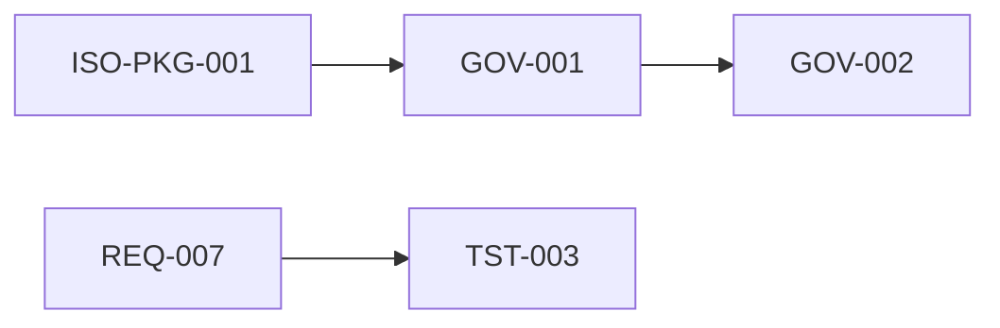

# Rastreabilidade entre documentos controlados

**Documento:** QMS-D2D-001  
**Versão:** 0.1  
**Data:** 2026-04-01  

Relações dirigidas entre códigos controlados (ilustrativas). Expandir conforme a maturidade do sistema de gestão.

| Origem | Destino | Relação |
|--------|---------|---------|
| ISO-PKG-001 | GOV-* … AI-* | Registro mestre → stubs controlados |
| GOV-001 | GOV-002 | Escopo informa a política |
| GOV-007 | REC-TPL-001 | Controle documental → modelos de registro |
| REQ-007 | REQ-002, REQ-003, REQ-004 | RTM → especificações |
| TST-003 | REQ-007 | Casos de teste ↔ rastreabilidade |
| PROC-MAN-004 | TST-001, QLT-001 | Processo liga testes e SDLC |
| ARC-004 | tests/api/contract.test.ts | Especificação API ↔ testes de contrato |

## Histórico de revisões

| Versão | Data | Autor | Resumo das alterações |
|--------|------|-------|------------------------|
| 0.1 | 2026-04-01 | BizCode | Grafo inicial |

**Outros idiomas:** [English](../../en/certificacion-iso/traceability-between-documents.md) · [Español](../../es/certificacion-iso/trazabilidad-entre-documentos.md)
