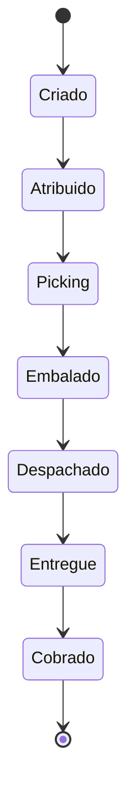

# Fluxo operacional — pedido → entrega → cobrança (desenho)

**Somente desenho.** Não afirma que existam UI ou recursos REST de “pedidos”; o MVP atual concentra-se em clientes, produtos e faturas ([`docs/api/openapi.yaml`](../../api/openapi.yaml)). Os estados conceituais alinham-se ao plano mestre; as responsabilidades mapeiam papéis **já definidos** em [`src/lib/rbac.ts`](../../../src/lib/rbac.ts).

## Ciclo de vida proposto (alvo)

| Estado (conceito) | Significado |
|-------------------|-------------|
| Criado | Pedido registrado (vendas / backoffice). |
| Atribuido | Encaminhado ao armazém ou rota (planejador / líder). |
| Picking | Separação de estoque (`orders.pick`). |
| Embalado | Pronto para despacho (detalhe operacional; pode fundir-se ao Picking no MVP). |
| Despachado | Entregue à transportadora ou motorista (`orders.dispatch`). |
| Entregue | Recebimento confirmado (`orders.deliver.confirm`). |
| Cobrado | Pagamento / liquidação alinhada a caixa ou finanças (fechamento comercial). |

## Mapa estilo RACI (papéis vs etapas)

“R” = executor principal, “A” = responsável final, “C” = consultado, “I” = informado. Permissões entre parênteses vêm da matriz RBAC.

| Etapa | seller | manager | backoffice | warehouse_op | warehouse_lead | logistics_planner | driver | billing / cashier | collections / finance | auditor |
|-------|--------|---------|------------|--------------|----------------|-------------------|--------|---------------------|----------------------|---------|
| Criar / registrar pedido | R (`orders.create`, `sales.create`) | R | C | I | I | I | I | C | I | I |
| Atribuir / priorizar | C | R | C | I | R | R | I | I | I | I |
| Picking | I | C | I | R (`orders.pick`) | R | I | I | I | I | I |
| Despacho | I | C | I | I | R (`orders.dispatch`) | R (`orders.dispatch`) | I | I | I | I |
| Confirmar entrega | I | I | I | I | I | I | R (`orders.deliver.confirm`) | I | I | I |
| Faturamento / vínculo de pagamento | C | C | C | I | I | I | I | R (`sales.create`) | C (`reports.financial.read`) | I |
| Cobrança / conciliação | I | I | I | I | I | I | I | C | R | C (`audit.read` quando aplicável) |
| Revisão de auditoria | I | I | I | I | I | I | I | I | I | R (`audit.read`) |

Células vazias: a etapa não tem permissão RBAC dedicada; o papel pode participar por desenho de processo.

## MVP atual vs fase “pedido” futura

| Área | No repositório hoje | Futuro (conforme backlog) |
|------|---------------------|---------------------------|
| Clientes / produtos / rubros | REST sob `/api/clientes`, `/api/articulos`, `/api/rubros` com auth | Estender conforme necessidade |
| Faturamento | `/api/facturas`, `/api/formas-pago` | Mesma base |
| Entidade pedido (`pedido`) | **Não evidenciada** no Prisma nem OpenAPI | Modelo, estados e APIs ao executar BP1-1 do plano de execução |
| Permissões `orders.*` | Definidas no RBAC; sem entidade de domínio ainda | Aplicar em novas rotas quando implementadas |

## Documentos relacionados

- Matriz RBAC: [matriz-rbac-funcoes-permissoes-scopes.md](matriz-rbac-funcoes-permissoes-scopes.md)
- Plano mestre + backlog P0/P1: [execucao-plano-mestre-bizcode.md](execucao-plano-mestre-bizcode.md)
- IAM: [modelo-iam-sessoes-auditoria.md](modelo-iam-sessoes-auditoria.md)
