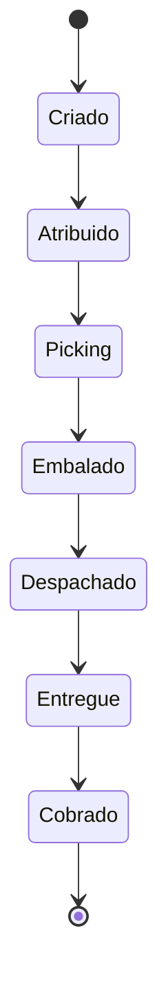

# Fluxo operacional — pedido → entrega → cobrança (desenho)

**Somente desenho.** Não afirma que existam UI ou recursos REST de “pedidos”; o MVP atual concentra-se em clientes, produtos e faturas ([`docs/api/openapi.yaml`](../../api/openapi.yaml)). Os estados conceituais alinham-se ao plano mestre; as responsabilidades mapeiam papéis **já definidos** em [`src/lib/rbac.ts`](../../../src/lib/rbac.ts).

## Ciclo de vida proposto (alvo)

```mermaid
stateDiagram-v2
  [*] --> Criado
  Criado --> Atribuido
  Atribuido --> Picking
  Picking --> Embalado
  Embalado --> Despachado
  Despachado --> Entregue
  Entregue --> Cobrado
  Cobrado --> [*]
```

## Estados canônicos de implementação (BP1-1 / GitHub #65)

O diagrama usa **nomes de ciclo de vida para o usuário**. Quando houver entidade persistida `Pedido`, OpenAPI e Prisma devem usar as **chaves em inglês** abaixo para alinhar issues, ADR e código.

| Chave de implementação | Equivale no diagrama | Significado |
|------------------------|----------------------|-------------|
| `draft` | Criado | Pedido registrado; editável; ainda não comprometido com o cumprimento. |
| `confirmed` | Atribuido | Comprometido para planejamento; pode-se atribuir armazém/rota. |
| `packed` | Picking / Embalado | Estoque preparado / pronto para despacho (no MVP pode ser um único estado). |
| `shipped` | Despachado | Entregue à transportadora ou etapa do motorista. |
| `delivered` | Entregue | Recebimento confirmado. |
| `invoiced` | (antes da cobrança) | Fatura vinculada (`Factura`) existente. |
| `collected` | Cobrado | Pagamento / liquidação encerrada para a linha do pedido. |

**Transições:** saltos inválidos (ex.: `draft` → `collected`) devem ser rejeitados na API futura. Cancelamentos: apenas a partir de `draft` ou `confirmed`, salvo ADR de implementação com terminal `cancelled`.

**Integrações:** `Cliente.creditLimit`, `Articulo.stock`, `DeliveryZone` e escopo de canal (`x-bizcode-channel` / `AuthScope.channels`) nos mesmos pontos da tabela RACI.

**Rascunhos (sem migrações):** artefatos Prisma/OpenAPI em [rascunho-implementacao-dominio-pedido.md](rascunho-implementacao-dominio-pedido.md).

| Estado (conceito) | Significado |
|-------------------|-------------|
| Criado | Pedido registrado (vendas / backoffice). |
| Atribuido | Encaminhado ao armazém ou rota (planejador / líder). |
| Picking | Separação de estoque (`orders.pick`). |
| Embalado | Pronto para despacho (detalhe operacional; pode fundir-se ao Picking no MVP). |
| Despachado | Entregue à transportadora ou motorista (`orders.dispatch`). |
| Entregue | Recebimento confirmado (`orders.deliver.confirm`). |
| Cobrado | Pagamento / liquidação alinhada a caixa ou finanças (fechamento comercial). |

## Mapa estilo RACI (papéis vs etapas)

“R” = executor principal, “A” = responsável final, “C” = consultado, “I” = informado. Permissões entre parênteses vêm da matriz RBAC.

| Etapa | seller | manager | backoffice | warehouse_op | warehouse_lead | logistics_planner | driver | billing / cashier | collections / finance | auditor |
|-------|--------|---------|------------|--------------|----------------|-------------------|--------|---------------------|----------------------|---------|
| Criar / registrar pedido | R (`orders.create`, `sales.create`) | R | C | I | I | I | I | C | I | I |
| Atribuir / priorizar | C | R | C | I | R | R | I | I | I | I |
| Picking | I | C | I | R (`orders.pick`) | R | I | I | I | I | I |
| Despacho | I | C | I | I | R (`orders.dispatch`) | R (`orders.dispatch`) | I | I | I | I |
| Confirmar entrega | I | I | I | I | I | I | R (`orders.deliver.confirm`) | I | I | I |
| Faturamento / vínculo de pagamento | C | C | C | I | I | I | I | R (`sales.create`) | C (`reports.financial.read`) | I |
| Cobrança / conciliação | I | I | I | I | I | I | I | C | R | C (`audit.read` quando aplicável) |
| Revisão de auditoria | I | I | I | I | I | I | I | I | I | R (`audit.read`) |

Células vazias: a etapa não tem permissão RBAC dedicada; o papel pode participar por desenho de processo.

## MVP atual vs fase “pedido” futura

| Área | No repositório hoje | Futuro (conforme backlog) |
|------|---------------------|---------------------------|
| Clientes / produtos / rubros | REST sob `/api/clientes`, `/api/articulos`, `/api/rubros` com auth | Estender conforme necessidade |
| Faturamento | `/api/facturas`, `/api/formas-pago` | Mesma base |
| Cobranças / pagamentos | Modelo `Cobro`; `POST/GET /api/cobros`; UI `/cobros`; dashboard `cobrosHoy`; cobranças recentes no formulário de cliente | Vincular à entidade pedido quando existir BP1-1 |
| UI / finanças contas a receber | `/finanzas`; `GET /api/reportes/aging`, `GET /api/reportes/cuenta-corriente/:clienteId` | Fluxos de cobrança conforme backlog |
| Relatórios | `/reportes`; `GET /api/reportes/ventas`, `stock-critico`, `cobranzas` (JSON ou CSV) | Tipos adicionais de relatório |
| Logística | `/logistica`, `/logistica/picking` (#143); `OrdenEntrega`; `GET/POST/PUT /api/ordenes-entrega`, `POST .../iniciar-picking`, `POST .../lista` | OE: `pending` → `picking` → `ready` → `assigned` (reparto) → `in_transit` → `delivered` \| `failed` \| `cancelled` |
| Entidade pedido (`pedido`) | Modelos `Pedido`/`PedidoItem`, `/api/pedidos`, UI `/pedidos` (#132); `requireModule('billing.orders')` (#223) | Estados `packed`…`collected` e transições genéricas (#65 / BP1-1 completo) |
| Permissões `orders.*` | Definidas no RBAC; aplicadas em `/api/ordenes-entrega` | Estender quando a entidade `pedido` existir |

O estado **Cobrado** do diagrama é coberto hoje em parte pelo **registro de cobranças** (`Cobro`), não por um registro `pedido`.

## Documentos relacionados

- Matriz RBAC: [matriz-rbac-funcoes-permissoes-scopes.md](matriz-rbac-funcoes-permissoes-scopes.md)
- Plano mestre + backlog P0/P1: [execucao-plano-mestre-bizcode.md](execucao-plano-mestre-bizcode.md)
- IAM: [modelo-iam-sessoes-auditoria.md](modelo-iam-sessoes-auditoria.md)
