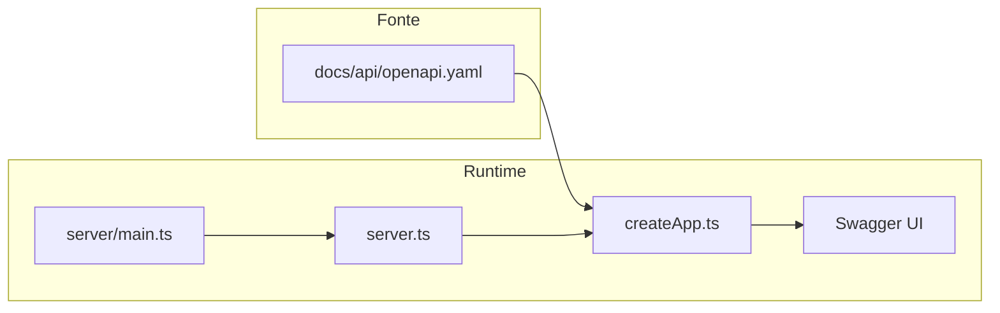

# Swagger / OpenAPI UI — plano de implementação e referência

| | |
|---|---|
| **Versão do documento** | 1.1.0 |
| **Última atualização** | 2026-04-01 |
| **Versionamento semântico** | Este documento segue a política de produto [SemVer / changelog](../certificacion-iso/ciclo-vida-e-validacao-documental.md); incrementar **minor** ao adicionar seções, **patch** para esclarecimentos. |
| **Status** | **Implementado** — Swagger UI em `/api-docs` a partir de [`server/createApp.ts`](../../../server/createApp.ts) (`swagger-ui-express` + [`docs/api/openapi.yaml`](../../api/openapi.yaml)); testes em [`tests/api/swagger-ui.test.ts`](../../../tests/api/swagger-ui.test.ts). |

## Finalidade

- Oferecer referência **única e trilíngue** (mesmo documento lógico em três caminhos localizados) para integração do **Swagger UI** e obrigações **OpenAPI** de agentes e contribuidores.
- Alinhar com [ciclo-vida-e-validacao-documental.md](../certificacion-iso/ciclo-vida-e-validacao-documental.md) e [ADR-0003](../adr/ADR-0003-api-contract-testing.md).

## Terminologia

- **OpenAPI** — formato do contrato; arquivo canônico: [`docs/api/openapi.yaml`](../../api/openapi.yaml) (arquivo único, não traduzido).
- **Swagger UI** — explorador interativo em **`/api-docs`** (ex.: `http://localhost:3001/api-docs/` com `npm run server`). **Não** substitui o YAML nem os [testes de contrato](../../../tests/api/contract.test.ts).

## Estado atual do repositório (última revisão)

- **Swagger UI / `swagger-ui-express`:** dependência em [`package.json`](../../../package.json); montagem em [`server/createApp.ts`](../../../server/createApp.ts); OpenAPI com [`yaml`](../../../package.json) (dependência de runtime).
- **Contrato:** [`docs/api/openapi.yaml`](../../api/openapi.yaml) + [`tests/api/contract.test.ts`](../../../tests/api/contract.test.ts) + [`tests/api/swagger-ui.test.ts`](../../../tests/api/swagger-ui.test.ts).
- **Bootstrap do servidor:** `npm run server` → [`server/main.ts`](../../../server/main.ts) → [`server.ts`](../../../server.ts) (`startServer` → `createServerInstance` → `createApp`). Montar Swagger UI apenas em **`createApp`** (o mesmo app do supertest).
- **Cobertura ([`vitest.config.ts`](../../../vitest.config.ts)):** `coverage.include` lista `server/createApp.ts` e `server.ts`; `server/main.ts` está excluído. Novos helpers (ex.: `server/openapiUi.ts`) devem entrar no `include` e ter cobertura **100%**, **ou** manter a configuração dentro de `createApp.ts`.
- **Comentários:** JSDoc trilíngue (`@en` / `@es` / `@pt-BR`) para blocos não óbvios conforme [padroes-codigo.md](../padroes-codigo.md).

## Decisões de produto

- **Stack de UI:** **Swagger UI** via `swagger-ui-express` (verificar compatibilidade ESM + Express 5). **Plano B:** HTML estático + Swagger UI via CDN + rota HTTP servindo o YAML.
- **Fonte da verdade:** sempre [`docs/api/openapi.yaml`](../../api/openapi.yaml).

## Checklist de implementação

1. ~~Adicionar dependência: `swagger-ui-express` (+ `@types/swagger-ui-express` se necessário).~~ **Feito**
2. ~~Em [`server/createApp.ts`](../../../server/createApp.ts), registrar **`/api-docs`** (`swaggerUi.serve` + `swaggerUi.setup`) com YAML e `import.meta.url`.~~ **Feito**
3. ~~**Testes:** `supertest` — **200** e HTML Swagger UI; cobertura **100%**.~~ **Feito** ([`tests/api/swagger-ui.test.ts`](../../../tests/api/swagger-ui.test.ts))
4. ~~Frase em `info.description` do `openapi.yaml` apontando para `/api-docs`.~~ **Feito**
5. **Documentação:** manter README / changelogs alinhados se URLs ou comportamento mudarem.
6. **Regras de agentes:** [`.cursor/rules/bizcode.mdc`](../../../.cursor/rules/bizcode.mdc) e [`AGENTS.md`](../../../AGENTS.md) — atualizados para `/api-docs` ativo.

## Nota de segurança

O OpenAPI descreve **loopback / sem auth** para o modelo atual de sidecar; reavaliar se a API for exposta além de localhost.

## Verificação

- `npm run lint` · `npm run test` · `npm run type-check`
- `npm run check:docs-map` se [`DOCUMENT_LOCALE_MAP.md`](../../DOCUMENT_LOCALE_MAP.md) mudar

## Arquitetura (runtime)

## Documentos relacionados

- [estrategia-testes.md](estrategia-testes.md) — testes de contrato vs OpenAPI
- [ciclo-vida-e-validacao-documental.md](../certificacion-iso/ciclo-vida-e-validacao-documental.md) — checklist quando a API HTTP mudar
- [ADR-0003](../adr/ADR-0003-api-contract-testing.md) — decisão de testes de contrato
